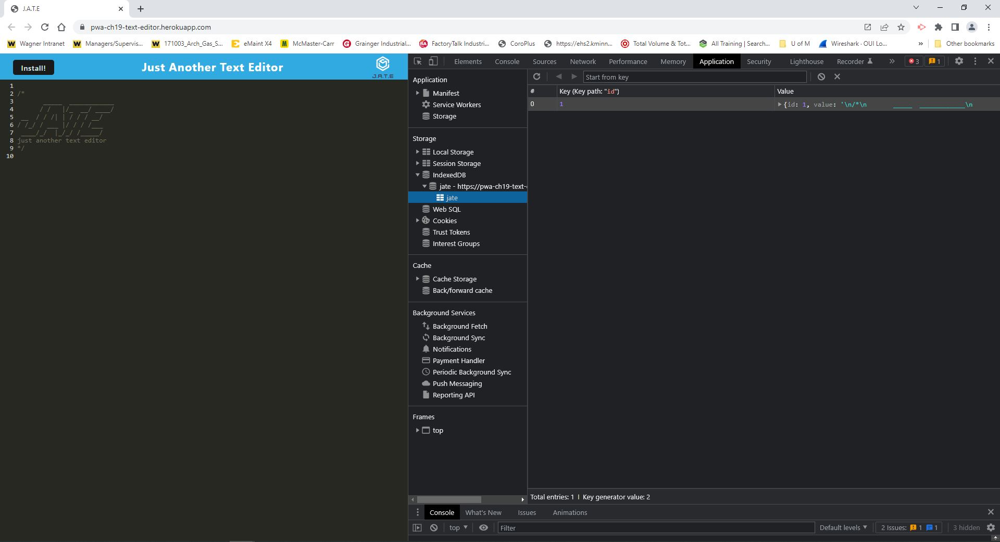
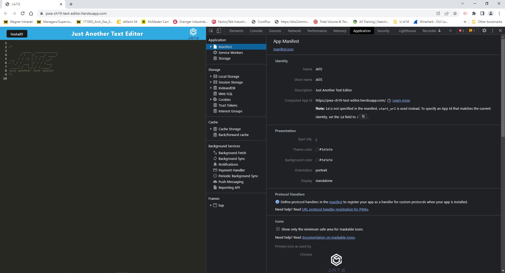
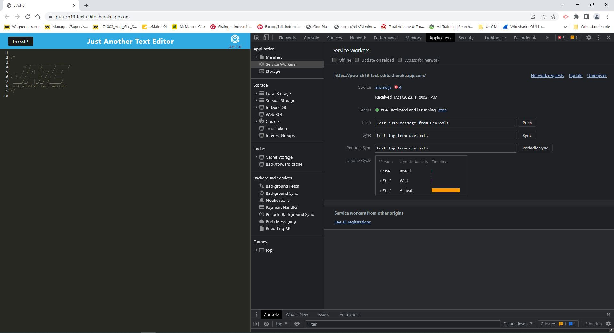

# Progressive-web-app-ch-19
  
  ## Description
  Your task is to build a text editor that runs in the browser. The app will be a single-page application that meets the PWA criteria. Additionally, it will feature a number of data persistence techniques that serve as redundancy in case one of the options is not supported by the browser. The application will also function offline.  
  
  
  
  
  ## Table of Contents
  1. [Installation](#installation)
  2. [Usage](#usage)
  3. [Contributing](#contributing)
  4. [Credits](#credits)
  5. [Tests](#tests)
  6. [License](#license)
  7. [Questions](#questions)

  ## Installation
  npm i  
  npm run install  
  npm run start  

  ## Usage
    
    
    
    

  
  ## Contributing
  To contribute please follow the link and read the contributing guide. https://github.com/github/docs/blob/dd9f70f9e7edb76e79fc43dee8fb3b8b8dfd1d20/CONTRIBUTING.md
  

  ## Credits
  
  
  

  ## Tests
  N/A
  

  ## License
  Copycenter (c) [wolfjfly](https://github.com/wolfjfly). All centers reserved. 
  
Licensed under the [MIT license](https://choosealicense.com/licenses/mit/)
  

  ## Questions
  Feel free to contact me with questions or comments @:
  - GitHub: [wolfjfly](https://github.com/wolfjfly)
  - Email: [benjamin_wlf@yahoo.com](mailto:benjamin_wlf@yahoo.com)
  
  ## Deployed
    
  github   
  https://github.com/wolfjfly/Progressive-web-app-ch-19  

  Heroku  
  https://pwa-ch19-text-editor.herokuapp.com/ | https://git.heroku.com/pwa-ch19-text-editor.git  

